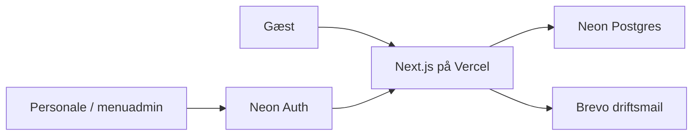

# Arkitektur

## Formål

Tee-Time er én Next.js App Router-webapp på Vercel med tre adskilte brugerflader: offentlig gæst, personale og menuadministration.

## Teknisk retning

| Område | Valg |
| --- | --- |
| App | Next.js App Router, React og TypeScript |
| Styling | Tailwind CSS og CSS-variabler |
| Database | Neon Postgres med Drizzle ORM og migrations |
| Auth | Neon Auth; servervaliderede `staff`- og `admin`-profiler |
| Mail | Brevo Transactional Email til restaurantens driftsadresse |
| Test | Vitest, React Testing Library og Playwright |
| Deployment | GitHub, Vercel Preview og Vercel Production |

## Systemgrænser

Gæster kan oprette ordre og følge den med et personligt, ugætteligt statuslink. Personale og menuadmin beskyttes af Neon Auth, og rollen hentes server-side fra `staff_profiles` ved hver beskyttet handling.

## Sikkerhedsregler

- Browseren sender produkt-id'er, antal og valgte tilvalg; serveren slår altid priser, tilgængelighed og total op igen.
- Statuslinkets token gemmes kun som hash i databasen.
- Alle mutationspayloads valideres på serveren.
- Database-, auth- og mailnøgler findes kun i servermiljøet.
- Mail til restauranten sendes efter en succesfuld database-commit. Mailfejl registreres, men ruller aldrig en oprettet ordre tilbage.

## Ordreflow (fase 3)

- Browseren sender kun produkt-slug, antal, valgte tilvalg, note og kontaktinput. Den sender aldrig en accepteret pris eller total.
- Serveren låser de aktive produkt- og tilvalgsrækker, kontrollerer udsolgt-status og genberegner alle beløb i øre.
- Ordre, varesnapshots, tilvalgssnapshots og første statushændelse oprettes i én database-transaktion.
- Et offentligt statustoken er 256 bit tilfældigt. Kun SHA-256-hashen ligger i Neon. Tokenet ligger efter `#` i statuslinket og sendes derfor ikke i HTTP-requestens URL eller almindelige request-logs; browseren sender det i stedet i body til et `POST`-status-API med `Cache-Control: private, no-store`.
- En `HttpOnly`, `SameSite=Lax` gæstesessions-cookie knytter ordreoprettelse og ordreoversigten til samme browser. Browseren kan kun bruge sine egne lokalt gemte tokenfragmenter til at åbne en af de session-bundne ordreposter eller forberede genbestilling.
- Oprettelse bruger en UUID-idempotency-key med en global unik constraint, så et første dobbeltklik heller ikke kan oprette to ordrer, før cookien er sat.
- Forespørgsler begrænses i en delt Neon-tabel efter platformens betroede klientadresse og svarer med `Retry-After` ved grænsen. Status siden læser et `no-store` API hvert 7,5 sekund. Der er ingen onlinebetaling.
- Login sender credentials til Neon Auth fra en serverroute. Efter Neon har godkendt dem, udsteder appen en kort, tilfældig, HttpOnly driftssession; dens hash ligger i `staff_sessions`. Rollen læses derefter fra `staff_profiles` ved hver side og API-mutation — aldrig fra browseren.
- Personale kan kun udføre serverens tilladte statusskift. Hvert skift sammenligner klientens forventede ordrevision med den aktuelle revision, forhøjer revisionen atomisk og opretter en statushændelse med bruger-id.

## Runtime-assets

Kun `public/images/` er runtime-kilde. Eksempler:

- `/images/tee-time-logo.png`
- `/images/golf-restaurant-terrasse.jpg`
- `/images/produktbilleder/produkter/aeblekage.webp`

`design-references/` er en separat, ikke-eksekverbar designkilde.
