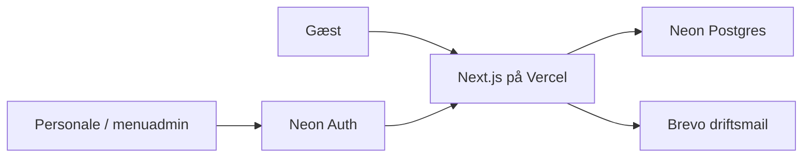

# Arkitektur

## Formål

Tee-Time er én Next.js App Router-webapp på Vercel med tre adskilte brugerflader: offentlig gæst, personale og menuadministration.

## Teknisk retning

| Område | Valg |
| --- | --- |
| App | Next.js App Router, React og TypeScript |
| Styling | Tailwind CSS og CSS-variabler |
| Database | Neon Postgres med Drizzle ORM og migrations |
| Auth | Neon Auth; servervaliderede `staff`- og `admin`-profiler |
| Mail | Brevo Transactional Email til restaurantens driftsadresse |
| Test | Vitest, React Testing Library og Playwright |
| Deployment | GitHub, Vercel Preview og Vercel Production |

## Systemgrænser

Gæster kan oprette ordre og følge den med et personligt, ugætteligt statuslink. Personale og menuadmin beskyttes af Neon Auth, og rollen hentes server-side fra `staff_profiles` ved hver beskyttet handling.

## Sikkerhedsregler

- Browseren sender produkt-id'er, antal og valgte tilvalg; serveren slår altid priser, tilgængelighed og total op igen.
- Statuslinkets token gemmes kun som hash i databasen.
- Alle mutationspayloads valideres på serveren.
- Database-, auth- og mailnøgler findes kun i servermiljøet.
- Mail til restauranten sendes efter en succesfuld database-commit. Mailfejl registreres, men ruller aldrig en oprettet ordre tilbage.

## Ordreflow (fase 3)

- Browseren sender kun produkt-slug, antal, valgte tilvalg, note og kontaktinput. Den sender aldrig en accepteret pris eller total.
- Serveren låser de aktive produkt- og tilvalgsrækker, kontrollerer udsolgt-status og genberegner alle beløb i øre.
- Ordre, varesnapshots, tilvalgssnapshots og første statushændelse oprettes i én database-transaktion.
- Et offentligt statustoken er 256 bit tilfældigt. Kun SHA-256-hashen ligger i Neon. Tokenet ligger efter `#` i statuslinket og sendes derfor ikke i HTTP-requestens URL eller almindelige request-logs; browseren sender det i stedet i body til et `POST`-status-API med `Cache-Control: private, no-store`.
- En `HttpOnly`, `SameSite=Lax` gæstesessions-cookie knytter ordreoprettelse og ordreoversigten til samme browser. Browseren kan kun bruge sine egne lokalt gemte tokenfragmenter til at åbne en af de session-bundne ordreposter eller forberede genbestilling.
- Oprettelse bruger en UUID-idempotency-key med en global unik constraint, så et første dobbeltklik heller ikke kan oprette to ordrer, før cookien er sat.
- Forespørgsler begrænses i en delt Neon-tabel efter platformens betroede klientadresse og svarer med `Retry-After` ved grænsen. Status siden læser et `no-store` API hvert 7,5 sekund. Der er ingen onlinebetaling.
- Login sender credentials til Neon Auth fra en serverroute. Efter Neon har godkendt dem, udsteder appen en kort, tilfældig, HttpOnly driftssession; dens hash ligger i `staff_sessions`. Rollen læses derefter fra `staff_profiles` ved hver side og API-mutation — aldrig fra browseren.
- Personale kan kun udføre serverens tilladte statusskift. Hvert skift sammenligner klientens forventede ordrevision med den aktuelle revision, forhøjer revisionen atomisk og opretter en statushændelse med bruger-id.

## Forenklet bestillings- og personaleflow (2026-08-25)

- Gæstesiden har kun ét bestillingssted: banen (`placement = "bane"`). Klubhus og terrasse findes stadig som gyldige API-værdier for bagudkompatibilitet, men vises ikke i gæste-UI'et.
- Ønsket tidspunkt vælges fra en dropdown i 15-minutters-intervaller, afgrænset af restaurantens åbningstider (`restaurant_settings`) og et minimum på 20 minutter fra nu. Samme vælger bruges af personalet, når de foreslår et alternativt tidspunkt.
- Personaleflowet er reduceret til to handlinger på en ny ordre: **Accepter** (og **Afvis**, med bekræftelsesdialog) — derefter er `approved` en slutstatus, uden yderligere klik. De tidligere mellemtrin (`preparing`, `ready`, `delivering`, `completed`) er bevaret i status-enum'et for bagudkompatibilitet med ældre rækker, men indgår ikke længere i det aktive flow.
- Gæstens statusside viser en almindelig sætning ("Din bestilling er i gang med at blive lavet, du kan hente den kl. X") i stedet for en flertrins-fremdriftsbjælke. Klokkeslættet er personalets foreslåede tidspunkt, hvis sat — ellers gæstens eget ønskede tidspunkt.

## Køkkenbon-udskrivning

Ingen fysisk printer er valgt endnu (Star TSP143IV X4 og Sunmi NT311 er overvejet — se noter i sessionshukommelsen). `lib/kitchen-printer.ts` implementerer et outbox-mønster, der spejler det eksisterende mail-outbox: når personalet trykker "Accepter", lægges en bon i `print_outbox` i samme transaktion som statusskiftet. `KITCHEN_PRINTER_URL` sætter den faktiske leveringsmekanisme senere — uden den forbliver bonnen `blocked` i stedet for tabt. `/api/internal/print-retry` er en beskyttet cron-rute, der spejler `/api/internal/email-retry`, inklusive den samme Hobby-plan-begrænsning (daglig kørsel; skal ændres til hvert femte minut før drift).

## Menuadministration

Menuadmin understøtter fuld administration direkte fra siden: opret/fjern kategorier, allergener og menupunkter, tilføj tilvalg pr. menupunkt, sæt allergener pr. menupunkt via klikbare mærker, og upload/fjern produkt- og tilbudsbilleder. Fjernelse er en soft delete (`is_active = false`); intet slettes fra databasen. Ændringer gemmes automatisk uden en eksplicit "Gem"-knap pr. felt.

Billedupload bruger Vercel Blob (`app/api/admin/upload/route.ts`). Uden en tilsluttet Blob-butik viser upload-knappen en tydelig "ikke konfigureret endnu"-fejl i stedet for at fejle. Se `.env.example` for opsætning — nyere Blob-butikker bruger OIDC (`VERCEL_OIDC_TOKEN` + `BLOB_STORE_ID`) i stedet for en statisk `BLOB_READ_WRITE_TOKEN`, og butikken skal være **Public** og tilsluttet **Development**-miljøet for at virke lokalt.

Tilbud med en pris bliver automatisk bestilbare: en tilsvarende `products`-række oprettes/opdateres under en auto-oprettet kategori `category-tilbud`, så "Bestil nu" på tilbudssiden går direkte til det bestilte punkt i stedet for den generelle menu. Tilbud uden pris fungerer som før og peger på den almindelige menu. Se `lib/admin-catalog.ts::syncOfferProduct`.

## Runtime-assets

Kun `public/images/` er runtime-kilde. Eksempler:

- `/images/tee-time-logo.png`
- `/images/golf-restaurant-terrasse.jpg`
- `/images/produktbilleder/produkter/aeblekage.webp`

`design-references/` er en separat, ikke-eksekverbar designkilde.
