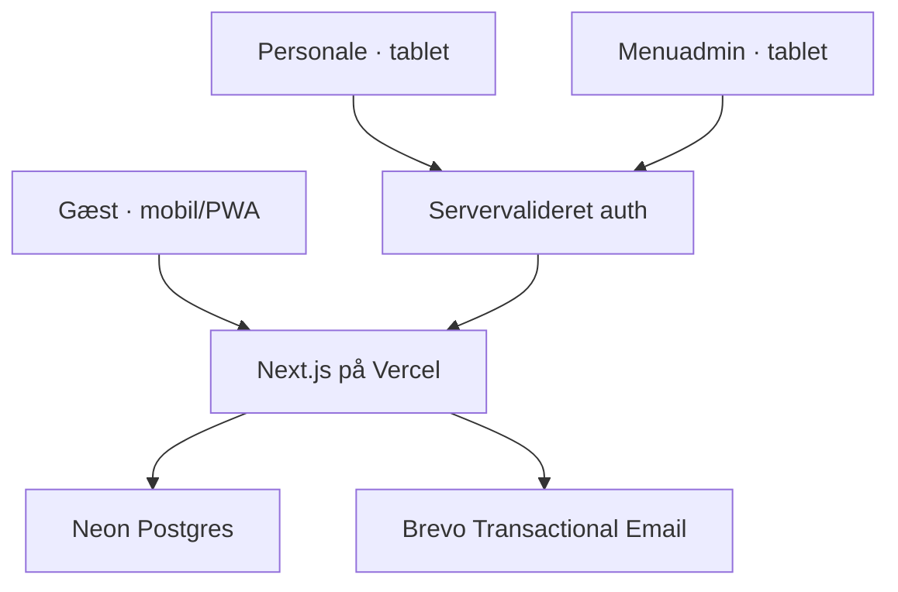
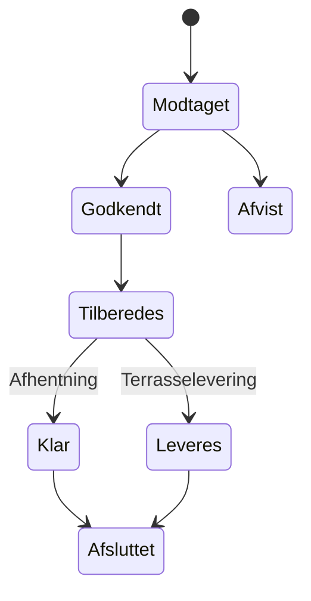

# Tee-Time — byggeplan til Codex

Version: 1.0  
Dato: 13. august 2026

## 1. Målet

Tee-Time skal bygges som én Next.js-webapp på Vercel med tre adskilte brugerflader:

1. **Gæst** — offentlig, mobilførst og installérbar som PWA.
2. **Personale** — beskyttet tabletvisning til behandling af ordrer.
3. **Menuadmin** — beskyttet tabletvisning til administration af menuen.

Den øverste skiftemenu med **Gæst / Personale / Menuadmin** og de viste iPhone-/iPad-rammer er kun præsentation. De må ikke indgå i den endelige løsning. I produktionsappen bruges separate URL'er og adgangskontrol.

Designfilerne er det visuelle facit, men prototypekoden skal ikke flyttes direkte over. Den indeholder al state i én browser og har ingen database, autorisation eller flerbrugersikkerhed.

## 2. Anbefalet første leverance

Første version bør være en enkel, driftssikker bestillingsløsning:

- Ingen onlinebetaling i første version.
- En ordre er en forespørgsel, som restauranten godkender eller afviser.
- Gæsten følger ordren via et personligt, ugætteligt statuslink.
- Status opdateres med polling hvert 5.–10. sekund; der tilføjes ikke en ekstra realtime-tjeneste.
- Tidligere ordrer findes kun på den samme browser/enhed, medmindre der senere tilføjes gæstelogin.
- Priser, tilgængelighed og totaler valideres altid på serveren.
- Brevo-mail er en sekundær kanal. En ordre må ikke gå tabt, fordi en mail ikke kan sendes.
- Produktbilleder kan ligge som statiske filer i første version. Upload fra admin kan senere tilføjes med Vercel Blob.

Dette holder stacken tæt på det ønskede: **Vercel + Neon + Brevo**.

## 3. Teknisk arkitektur



### Stack

| Område | Anbefaling | Hvorfor |
|---|---|---|
| App | Next.js App Router + TypeScript | Én kodebase til UI, serverlogik og Vercel-deployment |
| Styling | Tailwind CSS + CSS-variabler | Hurtig implementering af designets tokens uden at sprede vilkårlige værdier |
| Database | Neon Postgres | Varer, priser, ordrer, status og administration |
| Databasekode | Drizzle ORM + migrations | Tydeligt TypeScript-skema og kontrollerede databaseændringer |
| Validering | Zod | Samme eksplicitte regler ved alle servergrænser |
| Personale-login | Neon Auth som udgangspunkt | Login holdes i den valgte Neon-stack; roller kontrolleres også server-side. Auth.js + Brevo-magic-link er et muligt alternativ, der vælges i fase 0 |
| Mail | Brevo Transactional Email API | Driftsmail, ordrebekræftelse hvis gæste-email tilføjes, og evt. statusmail |
| Statusopdatering | Kort polling | Tilstrækkeligt til restaurantflowet og uden ekstra realtime-infrastruktur |
| Tests | Vitest + React Testing Library + Playwright | Beregninger, komponenter og komplette brugerflows |
| Deployment | GitHub → Vercel Preview → Production | Hver fase kan prøves på en sikker preview-URL |

### Ruter

#### Gæst — offentlig

| Rute | Formål |
|---|---|
| `/` | Vælg bane, klubhus eller terrasse |
| `/menu` | Kategorier og produkter |
| `/menu/[slug]` | Produkt, tilvalg, note og antal |
| `/kurv` | Kurv og total |
| `/bestilling` | Tidspunkt og kontaktoplysninger |
| `/ordre/[token]/bekraeftelse` | Kvittering efter oprettelse |
| `/ordre/[token]` | Personlig ordrestatus |
| `/tidligere` | Ordrer kendt af denne browser |
| `/tidligere/[token]` | Ordredetalje og genbestilling |
| `/tilbud` | Aktuelle tilbud |

#### Beskyttet

| Rute | Rolle |
|---|---|
| `/personale` | `staff` eller `admin` |
| `/menuadmin` | Kun `admin` |

Der findes ingen synlig rolleskifter. En bruger kan heller ikke opnå en rolle ved at ændre URL eller klient-state; autorisation kontrolleres i hver serverfunktion.

## 4. Designsystem og komponenter

### Design tokens

| Token | Værdi |
|---|---|
| Primær grøn | `#1E3328` |
| Cremebaggrund | `#F7F3EC` |
| Beige | `#E9E2D0` |
| Kortkanter | `#EFE7D8`, `#EDE4CF`, `#F3EEDF` |
| Sekundær tekst | `#8A8378` |
| Guldaccent | `#A9812F` |
| Fejl/rød | `#8C3B2E` |
| Mørk tekst | `#1C2620` |
| Overskrifter | Spectral 600–700 |
| Brødtekst/UI | Manrope 400–800 |
| Korthjørner | 14–18 px |
| Mobil sidepadding | 16–20 px |

### Genbrugelige komponenter

- `AppHeader`
- `BottomNavigation`
- `PageHeading`
- `LocationCard`
- `CategoryTabs`
- `ProductCard`
- `ProductOptionsForm`
- `AllergenBadge`
- `StatusBadge`
- `CartLine`
- `OrderSummary`
- `TimeSelector`
- `OrderStatusStepper`
- `StaffOrderCard`
- `AdminProductRow`
- `PrimaryButton`, `SecondaryButton`, `Toast`

Server Components bruges som standard. Klientkomponenter bruges kun, hvor der er interaktion, browser-state eller polling.

## 5. Datamodel i Neon

Penge gemmes som heltal i **øre**, ikke som decimaler eller tekst. Alle tidsstempler gemmes som `timestamptz`.

### Menu

| Tabel | Centrale felter |
|---|---|
| `service_locations` | `id`, `code`, `name`, `fulfillment_mode`, `requires_detail`, `is_active`, `sort_order` |
| `categories` | `id`, `name`, `slug`, `sort_order`, `is_active`, timestamps |
| `products` | `id`, `category_id`, `name`, `slug`, `description`, `price_ore`, `image_url`, `is_sold_out`, `is_active`, `sort_order`, timestamps |
| `allergens` | `id`, `name`, `sort_order` |
| `product_allergens` | `product_id`, `allergen_id` |
| `product_options` | `id`, `product_id`, `name`, `price_delta_ore`, `is_active`, `sort_order` |
| `offers` | `id`, `title`, `description`, `badge`, `image_url`, `starts_at`, `ends_at`, `is_active`, `sort_order` |

Kategorier, produkter og allergener bør som udgangspunkt deaktiveres frem for at blive slettet. Det forhindrer, at gamle ordrer mister deres historiske sammenhæng.

### Ordrer

| Tabel | Centrale felter |
|---|---|
| `guest_sessions` | `id`, `session_token_hash`, `last_seen_at`, `expires_at`, timestamps |
| `orders` | `id`, `guest_session_id`, `order_number`, `public_token_hash`, `idempotency_key`, `placement`, `fulfillment`, `location`, `status`, `customer_name`, `phone`, `email`, `requested_for`, `approved_for`, `total_ore`, `version`, timestamps |
| `order_items` | `id`, `order_id`, `product_id` nullable, `product_name_snapshot`, `unit_price_ore_snapshot`, `quantity`, `note` |
| `order_item_options` | `id`, `order_item_id`, `option_name_snapshot`, `price_delta_ore_snapshot` |
| `order_status_events` | `id`, `order_id`, `from_status`, `to_status`, `actor_user_id`, `reason`, `created_at` |

Ordrelinjer gemmer snapshots af navn og pris. Derfor ændrer en senere prisrettelse ikke gamle kvitteringer.

`order_number` er læsevenligt, fx `TT-1043`. Det er ikke en hemmelighed og må ikke bruges som adgangsnøgle. Statuslinket bruger et langt tilfældigt token; kun en hash af tokenet gemmes i databasen.

`idempotency_key` forhindrer, at et dobbeltklik eller et netværksretry opretter to ordrer.

`version` bruges til optimistisk låsning, så to medarbejdere ikke lydløst overskriver hinandens statusændring.

### Brugere og drift

| Tabel | Centrale felter |
|---|---|
| `staff_profiles` | `auth_user_id`, `display_name`, `role` (`staff`/`admin`), `is_active` |
| `restaurant_settings` | `accepting_orders`, standardtider, evt. åbningstider og driftsbesked |
| `email_outbox` | `order_id`, `email_type`, `recipient`, `idempotency_key`, `status`, `provider_message_id`, `attempts`, `next_attempt_at`, `last_error`, timestamps |

## 6. Ordreflow og statusskift



Serveren håndhæver statusskiftene. En klient må eksempelvis ikke sende en ordre direkte fra `modtaget` til `afsluttet`.

Ved godkendelse kan personalet:

- godkende det ønskede tidspunkt, eller
- foreslå et andet tidspunkt og gemme det som `approved_for`.

Ved hver ændring oprettes en post i `order_status_events`.

## 7. Serversikkerhed og dataprincipper

### Ufravigelige regler

- Neon- og Brevo-nøgler findes kun i servermiljøet.
- Klientens priser og total accepteres aldrig som sandhed.
- Serveren henter aktuelle produkter, priser, tilvalg og udsolgt-status igen ved checkout.
- Alle mutationspayloads valideres med Zod.
- Alle personale- og adminhandlinger kræver servervalideret session og rolle.
- Status-token må ikke skrives til almindelige driftslogs.
- Rate limiting indføres på ordreoprettelse, statusopslag og login.
- Noter vises som tekst og må aldrig rendres som HTML.
- Destruktive migrations må ikke køres uden en eksplicit backup-/rollback-plan.

### Persondata

Første version behøver kun navn og eventuelt mobilnummer. Email bør kun indsamles, hvis den faktisk bruges til gæstekvittering/status.

Fastlæg før produktion:

- hvor længe kontaktoplysninger gemmes,
- hvornår de anonymiseres eller slettes,
- hvem der må se arkivet,
- hvordan en gæst kan få indsigt eller sletning,
- hvilke Brevo-logdata der gemmes og hvor længe.

En praktisk begyndelse kan være kort aktiv opbevaring efterfulgt af anonymisering, mens økonomisk eller anden lovpligtig dokumentation håndteres særskilt. Den endelige periode skal besluttes af den dataansvarlige og ikke gættes i koden.

## 8. Tidligere ordrer uden gæstelogin

Designet viser tidligere bestillinger, men der er intet gæstelogin. Den enkleste løsning er:

1. Browseren får en tilfældig anonym session i en `HttpOnly`, `Secure`, `SameSite=Lax` cookie.
2. Kun en hash af sessionstokenet gemmes i `guest_sessions`.
3. Nye ordrer knyttes til den anonyme session, og `/tidligere` viser kun sessionens ordrer.
4. Rydning af cookies fjerner den lokale historik. Et gemt personligt ordrelink kan fortsat virke, indtil det udløber.
5. Genbestilling bruger aktuelle varer, priser og tilgængelighed — ikke gamle priser.
6. Udgåede eller udsolgte varer markeres og tilføjes ikke automatisk.

Det skal forklares tydeligt i UI'et: "Tidligere ordrer gemmes kun på denne enhed."

## 9. Brevo-plan

### Anbefalet brug i første version

- Mail til restaurantens driftsadresse ved ny ordre.
- Eventuelt mail til gæsten ved oprettelse og væsentlige statusskift, **kun hvis emailfelt tilføjes**.
- Mailhændelsen gemmes først i `email_outbox`; Brevo kaldes efter database-commit.
- Mailfejl kan gensendes med samme idempotency key. Automatisk retry-frekvens afhænger af Vercel-planen; manuel retry er tilstrækkelig i første pilot.
- API-kald sker udelukkende fra serverkode.
- Brevo sandbox-mode bruges under test.
- Afsenderdomæne og afsender skal verificeres før produktion.

Designet har i dag intet emailfelt. Derfor skal Brevo som standard opfattes som en driftskanal til restauranten. Gæstemail er et selvstændigt produktvalg.

## 10. PWA og offlineadfærd

Appen skal have manifest, relevante ikoner og en service worker, men offlineoplevelsen skal være konservativ:

- Statiske skaller, logoer og udvalgte billeder kan caches.
- Personale-, admin- og ordrestatussvar caches ikke som almindelige statiske data.
- En ordre vises aldrig som afleveret, før serveren har bekræftet oprettelsen og returneret ordre-id/token.
- Ved netværksfejl bliver kurven bevaret, og brugeren får en klar besked om, at ordren **ikke** er sendt.
- En gammel cache må ikke vise en udsolgt vare som sikkert bestilbar; checkout foretager altid ny servervalidering.

## 11. Faseplan

Hver fase afsluttes med et Git-checkpoint. Gå ikke videre, før acceptkriterier, tests og review er grønne.

### Fase 0 — Beslutninger og projektgrundlag

**Mål:** Et rent Next.js-projekt med fælles regler og dokumenterede beslutninger.

**Leverancer:**

- Next.js App Router, TypeScript, Tailwind, lint og testsetup.
- Assetstruktur med logo, terrassefoto og referenceskærme.
- `AGENTS.md` med projektregler.
- `docs/ARCHITECTURE.md`, `docs/DECISIONS.md` og `.env.example` uden hemmeligheder.
- Grundlæggende mapper til gæst, personale, admin, database og mail.
- Beslutning om gæste-email, auth-metode, billedlagring og retention.

**Acceptkriterier:**

- Appen starter lokalt.
- Lint, typecheck, tests og build består.
- Ingen preview-rolleskifter eller device-rammer findes i appen.
- Ingen produktionsnøgle er gemt i repoet.

### Fase 1 — Design og gæsteflow med testdata

**Mål:** Hele det viste gæstedesign virker responsivt uden database.

**Leverancer:**

- Hjem, menu, produkt, kurv, checkout, bekræftelse, status, tidligere og tilbud.
- Design tokens og genbrugelige komponenter.
- Kurv i versionsstyret localStorage; gæstehistorik knyttes senere til en sikker anonym session-cookie.
- Tastatur-, fokus- og skærmlæserhensyn.
- Rigtige URL-ruter og browserens tilbagefunktion.

**Acceptkriterier:**

- Det komplette mobilflow kan gennemføres med testdata.
- Referenceskærmene er visuelt sammenlignet på ca. 402 px bredde.
- Layoutet virker også på mindre/større telefoner.
- Ingen handling foregiver endnu at have gemt en rigtig ordre.

### Fase 2 — Neon, menu og seed-data

**Mål:** Menuen og tilbud kommer fra Neon.

**Leverancer:**

- Drizzle-skema, migrations og seed-script.
- Kategorier, produkter, tilvalg, allergener og tilbud.
- Server-side menuqueries.
- Preview-/udviklingsdatabase adskilt fra produktion.
- Constraints, indeks og deaktiveringsstrategi.

**Acceptkriterier:**

- En tom database kan oprettes reproducerbart via migrations + seed.
- Menuen viser Neon-data.
- Ingen databasecredential når browseren.
- Migrationen er testet på en ikke-produktionsbranch.

### Fase 3 — Rigtig ordre, status og historik

**Mål:** En gæst kan oprette og genåbne en sikker ordre.

**Leverancer:**

- Serverside checkout og transaktionel ordreoprettelse.
- Snapshot af varer, priser og tilvalg.
- Idempotency, tokenhash, ordrenummer og statusrute.
- Polling og tydelige fejl-/offlinebeskeder.
- Anonym `HttpOnly` sessions-cookie, tidligere ordrer på samme enhed og sikker genbestilling.

**Acceptkriterier:**

- Serveren afviser manipuleret pris, ugyldigt tilvalg og udsolgt vare.
- Dobbeltklik skaber højst én ordre.
- Token A kan ikke se ordre B.
- Refresh og genåbning af statuslink virker.
- Genbestilling bruger aktuelle priser.

### Fase 4 — Personale og menuadmin

**Mål:** Restauranten kan drive løsningen fra tablet.

**Leverancer:**

- Den i fase 0 valgte auth-løsning og rollerne `staff`/`admin`.
- Personaleoversigt med polling, aktive/arkiverede ordrer og statushandlinger.
- Menuadmin for produkter, priser, udsolgt, kategorier, allergener, tilvalg og tilbud.
- Optimistisk låsning og audit af statusskift.
- Bekræftelse ved risikofyldte adminhandlinger.

**Acceptkriterier:**

- En gæst kan ikke åbne beskyttede data.
- `staff` kan ikke udføre adminhandlinger.
- Ulovlige statusskift afvises på serveren.
- To tablets kan ikke overskrive hinanden lydløst.
- Pris/udsolgt ændres i gæstemenuen efter genindlæsning.

### Fase 5 — Brevo, PWA og produktionshardening

**Mål:** Appen er klar til kontrolleret pilotdrift.

**Leverancer:**

- Brevo-adapter, templates, outbox, sandbox-test og fejlregistrering.
- Manifest, ikoner og sikker service-worker-strategi.
- Rate limiting, sikkerhedsheaders og struktureret fejllogning uden følsomme data.
- Datapolitik, runbook, backup/restore-øvelse og miljøvariabeloversigt.
- Vercel Preview- og Production-konfiguration.
- End-to-end-tests af gæst → personale → status.

**Acceptkriterier:**

- Mailfejl ødelægger ikke ordreoprettelsen.
- Appen lover aldrig en offline-oprettet ordre, som serveren ikke har modtaget.
- Hele historien er browsertestet på mobil og tablet.
- Produktionsdatabase og previewdatabase er adskilt.
- Pilotens stop-/rollback-procedure er dokumenteret.

### Fase 6 — Pilot og efterfølgende iteration

**Mål:** Afprøv med rigtige medarbejdere og et begrænset antal gæster.

**Pilotmålinger:**

- Antal modtagne og afviste ordrer.
- Tid fra modtaget til godkendt.
- Antal foreslåede ændrede tidspunkter.
- Fejl ved checkout/mail/status.
- Personalets oplevelse af overblik og dobbeltarbejde.
- Gæsternes forståelse af, at ordren først er accepteret ved godkendelse.

Betaling, pushnotifikationer, avanceret køkkenkapacitet og gæstelogin vurderes først efter pilotdata.

## 12. Arbejdsform med Codex-subagenter

### Grundregel: én skriver, flere kontrollerer

I første produktionsversion bør hovedagenten være den eneste, der ændrer kode. Subagenter bruges til afgrænsede, læsetunge opgaver:

- udforskning af kodebasen,
- designaudit,
- database- og sikkerhedsreview,
- testplan og analyse af testfejl,
- tilgængelighedsreview,
- dokumentationskontrol.

Det gør det let at forstå, hvem der har gjort hvad, og mindsker mergekonflikter. Parallelle skriveagenter bruges først senere og kun i separate Git-worktrees med helt adskilt filejerskab.

### Læringsstige

1. **Fase 0–1:** Subagenter læser og rapporterer kun.
2. **Fase 2–3:** En subagent må køre tests; hovedagenten skriver stadig al kode.
3. **Fase 4–5:** Flere specialiserede reviewagenter kan arbejde parallelt.
4. **Senere:** Parallel implementering i separate worktrees, når kontrakter og ejerskab er fastlagt.

### En god subagentopgave har fem dele

1. **Afgrænset mål:** fx "review Neon-skemaets constraints".
2. **Konkrete input:** hvilke filer, ruter eller diff den skal se.
3. **Klar rettighed:** read-only, test-only eller præcise filer den må ændre.
4. **Leverance:** fx fund prioriteret som kritisk/høj/mellem/lav.
5. **Stopregel:** den må ikke udvide scope eller rette noget på egen hånd.

## 13. Copy/paste-prompts til Codex

### Prompt 0 — start hele projektet i Plan mode

```text
Vi skal bygge Tee-Time som en produktionsklar Next.js-app på Vercel med Neon Postgres og Brevo Transactional Email.

Start i Plan mode og ændr ingen filer endnu.

Læs projektets AGENTS.md, alle designreferencer og Tee-Time-Codex-Byggeplan.md. Vigtigt: den øverste skiftemenu Gæst/Personale/Menuadmin og de viste device-rammer er kun præsentation og må ikke være med i leverancen.

Spawn to read-only subagenter i parallel:
1. En explorer, der kortlægger eksisterende filer, skærme, brugerflows og genbrugelige komponenter.
2. En arkitektur-reviewer, der kontrollerer fase 0-planen, sikkerhedsgrænserne og de beslutninger, som kræver mit svar.

Vent på begge og saml derefter én konkret plan kun for fase 0. Vis:
- filer der skal oprettes
- afhængigheder og hvorfor de er nødvendige
- beslutninger jeg skal tage
- verifikation og definition of done

Implementér intet, før jeg har godkendt fase 0-planen.
```

### Prompt 1 — projektgrundlag

```text
Implementér kun fase 0 fra Tee-Time-Codex-Byggeplan.md og den godkendte plan.

Du er eneste skriveagent. Opret Next.js/TypeScript-grundlaget, AGENTS.md, dokumentation, eksempel på miljøvariabler og test/build-setup. Medtag ikke præsentations-rolleskifteren eller device-rammerne. Tilføj ingen rigtig credential og forbind endnu ikke til produktion.

Når implementeringen er færdig, spawn én read-only reviewer, der kontrollerer:
- scope og uvedkommende ændringer
- hemmeligheder og risikable defaults
- scripts, lint, typecheck, tests og build
- om fase 0's acceptkriterier er opfyldt

Ret verificerede fund, kør alle checks, vis et kort diff-resumé og stop. Commit ikke, før jeg har set resultatet.
```

### Prompt 2 — gæstedesign

```text
Implementér kun fase 1 fra Tee-Time-Codex-Byggeplan.md med statiske typed fixtures. Genskab referenceskærmene i Next.js uden prototypekode, device-rammer eller rolleskifter.

Du er eneste skriveagent. Brug design tokens og genbrugelige komponenter. Kurven må gerne ligge versionsstyret i localStorage, men appen må ikke foregive at have oprettet en rigtig ordre.

Efter implementeringen skal du spawn to read-only subagenter i parallel:
1. En design-auditor, der sammenligner hver mobilrute med referenceskærmene og rapporterer målbare afvigelser.
2. En accessibility-reviewer, der kontrollerer tastatur, fokus, labels, kontrast, touch targets og reduceret bevægelse.

Vent på begge, ret væsentlige fund, og kør lint, typecheck, tests, build og browserverifikation af hele gæsteflowet.
```

### Prompt 3 — Neon

```text
Implementér kun fase 2 fra Tee-Time-Codex-Byggeplan.md.

Du er eneste skriveagent. Opret Drizzle-skema, migrations, seed-data og server-side læsning af menu/tilbud fra en ikke-produktions Neon-database. Penge skal være heltal i øre. Brug stabile id'er, constraints, indeks og deaktivering frem for destruktiv sletning.

Spawn parallelt:
- en read-only database-reviewer for relationer, constraints, indeks og migrations-/rollbackrisici
- en test-planlægger for seed-, query- og migrationsscenarier

Vent på begge, implementér relevante rettelser og dokumentér lokal, preview og production opsætning uden hemmeligheder. Kør ikke nogen destruktiv produktionsmigration.
```

### Prompt 4 — ordreflow

```text
Implementér kun fase 3 fra Tee-Time-Codex-Byggeplan.md.

Krav:
- serveren genberegner varer, tilvalg, priser og total
- ordre og snapshots oprettes i én transaktion
- et langt tilfældigt statustoken bruges offentligt, og kun tokenhash gemmes
- idempotency forhindrer dubletter
- tidligere ordrer er kun kendt på samme enhed
- polling viser status uden at cache følsomme svar
- ingen onlinebetaling

Du er eneste skriveagent. Når flowet virker, spawn:
1. en test-agent til prismanipulation, udsolgt-race, dobbeltklik, ugyldige tokens og genbestilling
2. en read-only sikkerhedsreviewer til validering, datalæk, logning, rate limiting og autorisationsgrænser

Vent på begge, ret kritiske og høje fund, og verificér historien browser → server → Neon → statusvisning med evidens.
```

### Prompt 5 — personale og menuadmin

```text
Implementér kun fase 4 fra Tee-Time-Codex-Byggeplan.md. Implementér personale først og menuadmin bagefter.

Brug den servervaliderede auth-løsning, der blev godkendt i fase 0, samt roller. Klienten må aldrig selv kunne tildele rolle eller springe ulovligt mellem ordrestatusser. Brug optimistisk låsning ved statusændringer.

Du er eneste skriveagent. Spawn derefter tre read-only reviewagenter i parallel:
- auth/autorisation og sikkerhed
- samtidige statusændringer og dataintegritet
- tablet-layout, accessibility og visuel overensstemmelse

Vent på alle. Saml fund efter alvorlighed, ret de væsentlige, og browsertest med mindst én staff-bruger, én admin-bruger og én ikke-autoriseret session.
```

### Prompt 6 — produktionsklar pilot

```text
Implementér kun fase 5 fra Tee-Time-Codex-Byggeplan.md.

Konfigurér Brevo fra serverkode, email delivery-log/retry, sandbox-test, PWA-manifest, konservativ offlineadfærd, sikkerhedsheaders, rate limiting, fejllogning og Vercel-miljøer. Ingen hemmeligheder må skrives i repo eller logoutput.

Spawn parallelle read-only agenter til:
- sikkerhed og persondata
- PWA/offline og performance
- accessibility/responsivt design
- testdækning og release readiness

Vent på alle. Ret kritiske og høje fund. Verificér derefter end-to-end:
gæst bestiller → Neon gemmer → personale godkender → gæst ser status → Brevo-hændelse registreres.

Vis til sidst en releasecheckliste med kendte risici og en rollback-plan. Deploy ikke til Production uden min udtrykkelige godkendelse.
```

### Prompt 7 — gentageligt review efter hver feature

```text
Review de aktuelle uncommitted ændringer. Ændr ingen filer først.

Spawn tre read-only subagenter i parallel:
1. correctness/test gaps
2. security/privacy
3. maintainability/accessibility

Bed hver agent om kun at rapportere konkrete fund med fil, symbol eller reproduktion og alvorlighed. Vent på alle og saml dubletter.

Vis mig først den prioriterede fundliste. Ret kun fund, jeg godkender. Kør derefter de relevante tests samt lint, typecheck og build.
```

## 14. Forslag til `AGENTS.md`

```md
# Tee-Time

## Produkt
- Tre brugerflader: gæst, personale og menuadmin.
- Preview-rolleskifter og device-rammer er ikke produktfunktioner.
- Designfilerne er visuel reference, ikke produktionskode.
- Første version har ingen onlinebetaling.

## Tech
- Next.js App Router og TypeScript på Vercel.
- Neon Postgres med Drizzle-migrations.
- Brevo Transactional Email kun fra serverkode.

## Sikkerhed
- Ingen hemmeligheder i klientkode, logs eller repository.
- Personale og admin kræver servervalideret session og rolle.
- Serveren validerer varer, priser, totaler og statusskift.
- Penge gemmes som heltal i øre.
- Kør ikke destruktive migrations eller nulstil data uden godkendelse.
- Produktionsdeploy kræver udtrykkelig godkendelse.

## Arbejdsform
- Planlæg før større ændringer.
- Én skriveagent ad gangen som standard.
- Subagenter er read-only, medmindre prompten angiver eksakte filer.
- Undgå ændringer uden for den aktive fase.
- Tilføj ikke produktionsafhængigheder uden at forklare behovet.
- Bevar brugerens eksisterende ændringer og commits.

## Definition of done
- Acceptkriterierne er demonstreret.
- Lint, typecheck, tests og build består.
- Berørte mobil- og tabletflows er browsertestet.
- Diff er reviewet for sikkerhed, regressioner og uvedkommende ændringer.
- Dokumentation og `.env.example` er opdateret.
```

## 15. Definition of done — fem grønne lys

En fase er først færdig, når:

1. Funktionen opfylder fasens acceptkriterier.
2. Lint, typecheck, tests og produktionsbuild består.
3. Det relevante brugerflow er prøvet i en rigtig browser.
4. En anden agent har reviewet ændringen.
5. Du har set opsummeringen og godkendt checkpointet.

## 16. Beslutninger før fase 3–5

| Spørgsmål | Anbefalet standard |
|---|---|
| Onlinebetaling? | Nej i første version |
| Gæste-email? | Nej som krav; tilføj valgfrit, hvis gæstekvittering ønskes |
| Hvem modtager Brevo-mail? | Restaurantens fælles driftsadresse |
| Personale-login? | Neon Auth som udgangspunkt; Auth.js + Brevo-magic-link vurderes i fase 0 |
| Produktbilleder? | Statiske filer først; Vercel Blob når admin-upload ønskes |
| Tidligere ordrer? | Kun samme browser/enhed |
| Statusopdatering? | Polling hvert 5.–10. sekund |
| Åbningstider/kapacitet? | Simpelt `accepting_orders`-flag først; mere efter pilot |
| Data retention? | Skal godkendes af den dataansvarlige før produktion |

## 17. Aktuelle officielle referencer

- [OpenAI: Subagents](https://developers.openai.com/codex/agent-configuration/subagents)
- [OpenAI: AGENTS.md](https://developers.openai.com/codex/agent-configuration/agents-md)
- [OpenAI: Codex best practices](https://developers.openai.com/codex/learn/best-practices)
- [Next.js: App Router](https://nextjs.org/docs/app)
- [Next.js: Authentication](https://nextjs.org/docs/app/guides/authentication)
- [Next.js: Data security](https://nextjs.org/docs/app/guides/data-security)
- [Next.js: Progressive Web Apps](https://nextjs.org/docs/app/guides/progressive-web-apps)
- [Neon: Connect a Next.js application](https://neon.com/docs/guides/nextjs)
- [Neon: Vercel integration](https://neon.com/docs/guides/neon-managed-vercel-integration)
- [Neon: Choosing a connection method](https://neon.com/docs/connect/choose-connection)
- [Brevo: Send a transactional email](https://developers.brevo.com/docs/send-a-transactional-email)
- [Brevo: Sandbox mode](https://developers.brevo.com/docs/using-sandbox-mode)
- [Vercel: Environment variables](https://vercel.com/docs/environment-variables)
